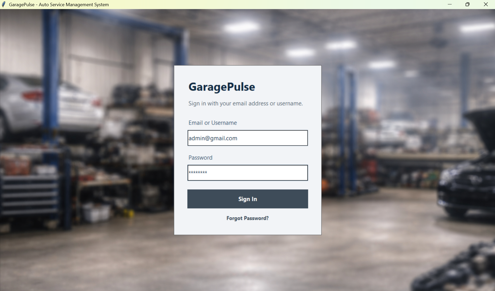
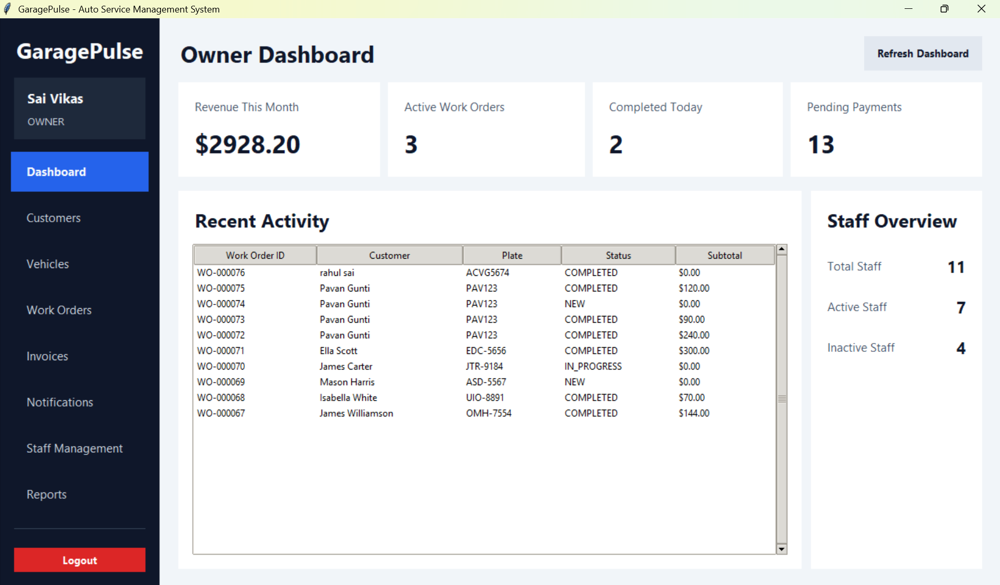
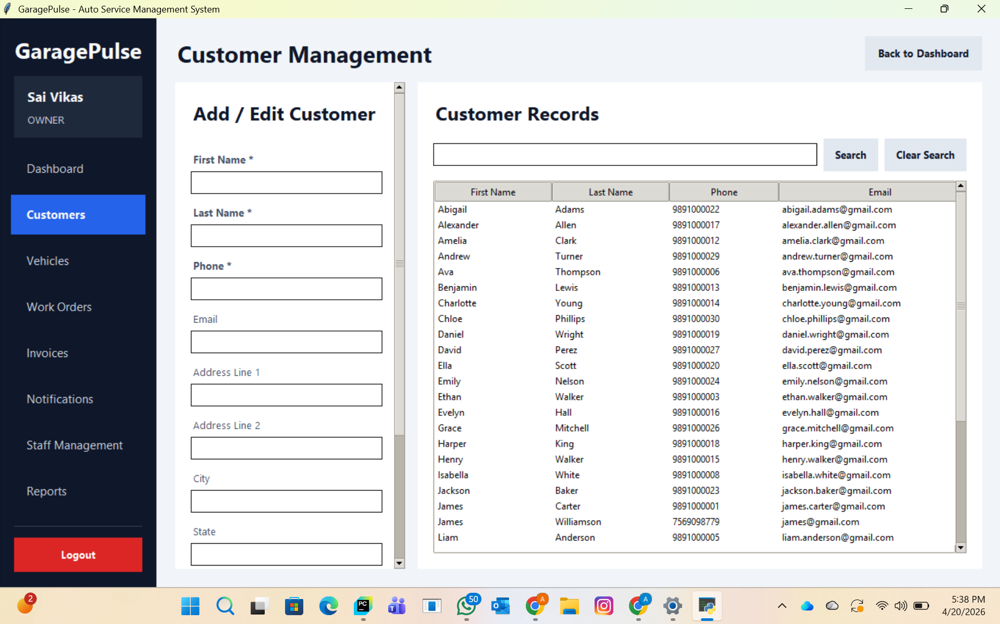
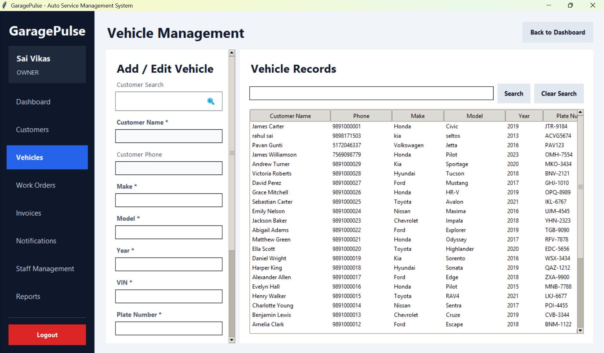
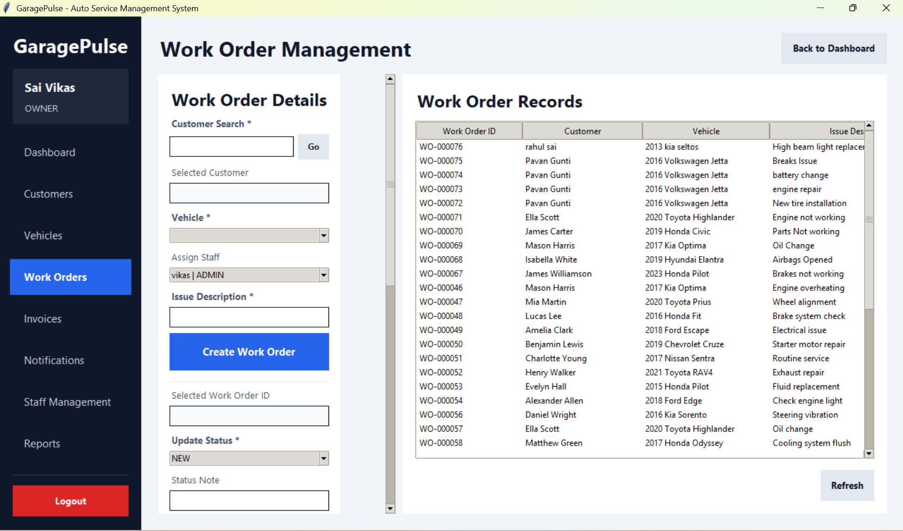
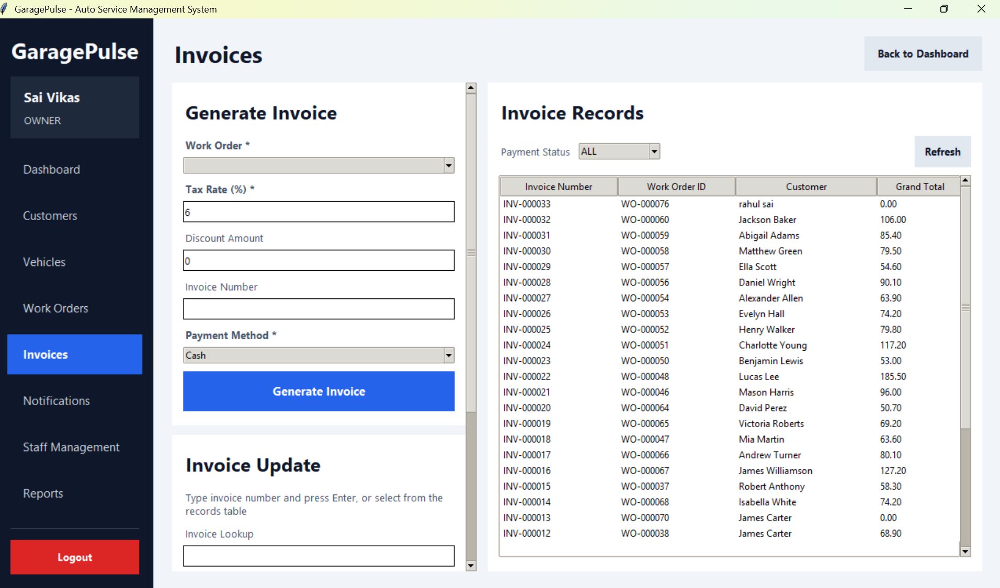
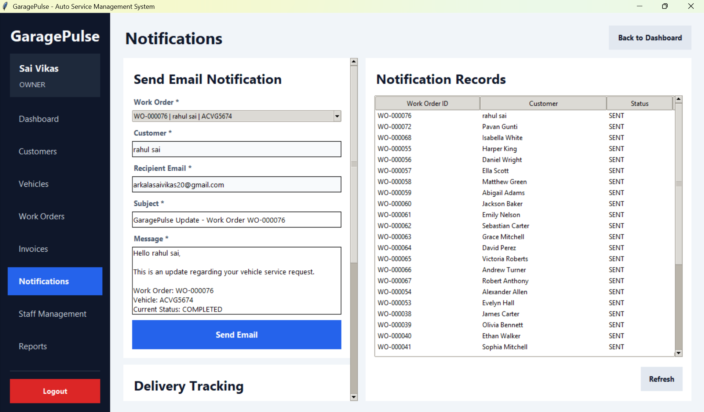
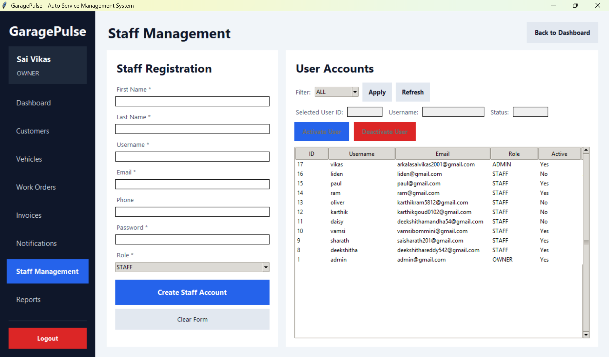
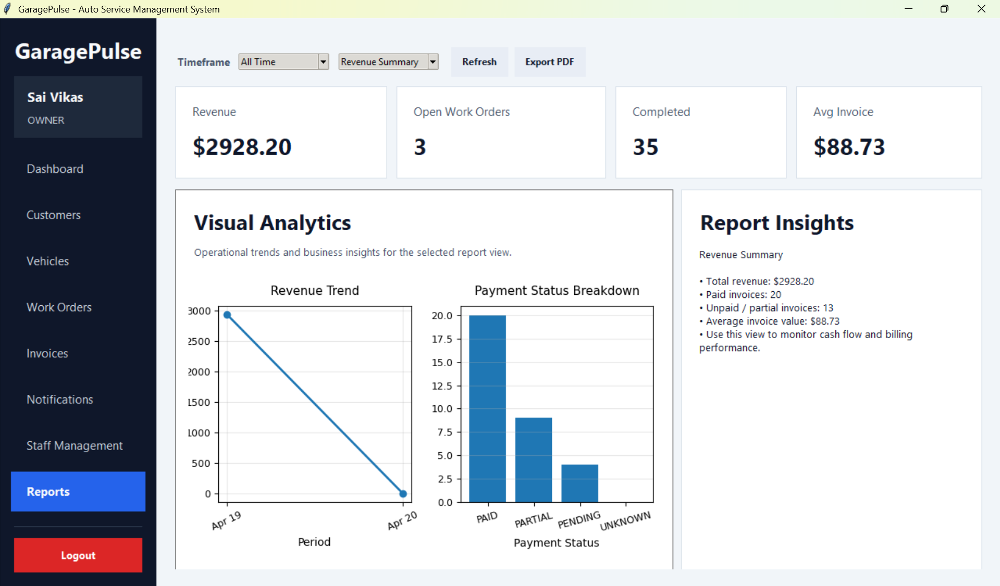

# 🚗 GaragePulse - Auto Service Management System

GaragePulse is a **desktop-based Auto Service Management System** built using **Python (Tkinter) and MySQL**.
It is designed to simulate a **real-world garage management application** with a production-level structure, UI, and workflow.

The application helps manage customers, vehicles, service requests, billing, notifications, staff, and analytics in a single system.

---

## 📌 Project Overview

GaragePulse streamlines the entire service lifecycle in an automotive garage:

* Customer registration
* Vehicle tracking
* Work order creation
* Service status management
* Invoice generation
* Customer notifications
* Business reporting

This project follows a **clean layered architecture** similar to real-world enterprise applications.

---

## ✨ Features

### 🔐 Authentication

* Secure login system
* Role-based access (Owner / Staff)

### 📊 Dashboard

* Revenue summary
* Active work orders
* Completed jobs
* Pending payments
* Staff overview
* Recent activity tracking

### 👤 Customer Management

* Add / Edit customers
* Store contact and address details
* Search functionality

### 🚗 Vehicle Management

* Link vehicles to customers
* Store VIN, plate number, model, year
* Manage vehicle records

### 🛠 Work Order Management

* Create work orders per vehicle
* Assign staff
* Add issue descriptions
* Track status (NEW → IN PROGRESS → COMPLETED)

### 🧾 Invoice Management

* Generate invoices from work orders
* Apply tax and discounts
* Track payment status

### 📧 Notifications

* Send email updates to customers
* Auto-fill work order details
* Track sent notifications

### 👨‍💼 Staff Management

* Create staff accounts
* Activate / deactivate users
* Role assignment

### 📈 Reports & Analytics

* Revenue insights
* Payment status breakdown
* Charts and trends
* Export support

---

## 🛠 Tech Stack

| Layer     | Technology         |
| --------- | ------------------ |
| UI        | Python Tkinter     |
| Backend   | Python             |
| Database  | MySQL              |
| Security  | bcrypt             |
| Reporting | matplotlib, pandas |
| PDF       | reportlab          |

---

## 🏗 Architecture

```text
UI Layer (Tkinter)
        ↓
Controllers
        ↓
Services (Business Logic)
        ↓
Repositories (DB Access)
        ↓
MySQL Database
```

---

## 📸 Application Screenshots

### 🔐 Login Screen

<p align="center">
  
</p>

---

### 📊 Dashboard

<p align="center">
  
</p>

---

### 👤 Customer Management

<p align="center">
  
</p>

---

### 🚗 Vehicle Management

<p align="center">
  
</p>

---

### 🛠 Work Order Management

<p align="center">
  
</p>

---

### 🧾 Invoice Management

<p align="center">
  
</p>

---

### 📧 Notifications

<p align="center">
  
</p>

---

### 👨‍💼 Staff Management

<p align="center">
  
</p>

---

### 📈 Reports & Analytics

<p align="center">
  
</p>

---

## ⚙️ Installation & Setup

### 1. Clone Project

```bash
git clone <your-repo>
cd GaragePulse
```

---

### 2. Create Virtual Environment

```bash
python -m venv .venv
.venv\Scripts\activate
```

---

### 3. Install Dependencies

```bash
pip install -r requirements.txt
```

---

### 4. Configure Environment

Create `.env` file:

```env
DB_HOST=your_host
DB_NAME=your_database
DB_USER=your_user
DB_PASSWORD=your_password
```

---

### 5. Setup Database

* Open MySQL Workbench
* Run your SQL file:

```sql
garagepulse.sql
```

---

### 6. Run Application

```bash
python main.py
```

---

## 👥 User Roles

| Role  | Access                     |
| ----- | -------------------------- |
| OWNER | Full system access         |
| STAFF | Limited operational access |

---

## 🔄 Workflow

1. Add Customer
2. Register Vehicle
3. Create Work Order
4. Assign Staff
5. Update Status
6. Generate Invoice
7. Record Payment
8. Send Notification
9. Analyze Reports

---

## 📁 Project Structure

```text
GaragePulse/
├── controllers/
├── services/
├── repositories/
├── models/
├── database/
├── ui/
├── utils/
├── docs/
│   └── images/
├── main.py
├── requirements.txt
├── README.md
```

---

## 🚀 Future Enhancements

* SMS integration
* Online payments
* Mobile application
* Cloud deployment
* Inventory module

---

## 👨‍💻 Author

**Sai Vikas**
Master’s in Information Systems
Central Michigan University

---

## 📄 License

This project is for academic and demonstration purposes.
